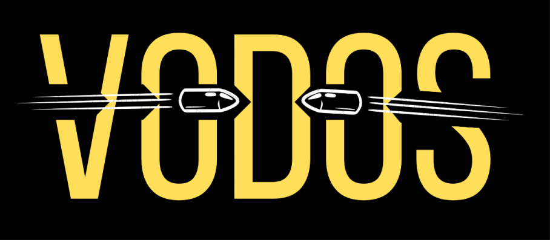

  

<h1 align="center">VODOS ᵈᵉᵐᵒ</h1>
<i><b>Vodos</b>, Python ile yazılmış SMS-Bomber araçlarından bir tanesidir. Yaklaşık 55'e yakın site üzerinden doğrulama işlemlerini sağlayarak hedef telefon adresine SMS saldırıları düzenleyebilir. Proje şu anlık Türkiye hatları üzerine kurulmuştur ancak yakında global olarak bütün telefon numaralarını destekleyecektir.</i>

<h2 align="center">Sorumluluk Reddi</h2>
<i>Bu araç, eğitim amaçlı olarak hazırlanmıştır ve sadece bu amaçla kullanılmalıdır. Aracın kullanımından doğabilecek herhangi bir sonuçtan yazar ekibi olarak bizler sorumlu değiliz. Aracı kullanan kişiler, bu sorumluluğu kabul etmiş olmalıdır ve herhangi bir olumsuz durumda tek başlarına sorumlu olacakları unutulmamalıdır. Bu sebeple, aracı kullanmadan önce kullanım şartlarını ve yerel yasal mevzuatı dikkatlice okumanızı öneririz.</i>

 

<i>Araç açık kaynak kodlu olarak sunulmaktadır ve birden fazla kaynakta kopyalanma olasılığı yüksektir. Bu sebeple, aracın paylaşımı yalnızca GitHub ve bu sayfadaki bağlantılar üzerinden sağlanmaktadır. Bu dışında yapılan kopyalamalar, telif haklarına uygun olmadığı gibi, izinsiz yayın yapan kişinin sorumluluğunda olacaktır. Lütfen yasal ve etik değerlere uygun olarak aracı kullanın. Ayrıca, bu aracın yazar ekibi sorumlu tutulamaz.</i>

 

<i><b>Bu araç, SMS hizmetleri için potansiyel olarak zararlı veya tehlikeli olabilecek materyaller içermektedir.</b> Buna erişmeden, kullanmadan veya başka bir şekilde yanlış bir şekilde kullanmadan önce ilinizdeki/ülkenizdeki yasalara bakın.</i>

<h2>İşleyiş</h2>
<i>Proje belirli bir periyod üzerine kurulmuştur. Bu periyod hedeflenen sitelere hedeflenen telefon numarası ile kayıt oluşturarak doğrulama kodunun hedeflenen numara sahibine gitmesini sağlar. Süre olarak hızlı çalışır ancak internet hızı, işlemci hızı, Sunucu durumu veya DNS çözümleme gibi durumlar hızı etkileyen faktörlerdir.</i>

<h2>Merak Edilen Sorular</h2>
<h3>Bu işten zararlı çıkar mıyım?</h3>
- Evet, SMS Bomber gibi atak türleri ülkelerin aldığı kararlar gereği yasadışı olarak kabul edilmiştir. Bir kişiyi rahatsız etmek, kişinin cihazına zarar vermek, istismar etmek gibi durumlardan ötürü hakkınızda dava açılırsa bunun altından zararlı çıkabilirsiniz.

<h3>Proxy veya VPN desteği sağlıyor mu?</h3>
- Hayır, Proxy veya VPN kullanmak proje hızında değişikliklere, aksamalara yol açabilir. Günümüzde ücretsiz Proxy veya VPN desteği sağlayan birçok hizmet olmasına rağmen sunucu hızları veya key isteme durumları çok azim gerektiren bir iştir ve bu nedenle Proxy veya VPN destekleri sağlanmamıştır.

<h3>SMS saldırılarından nasıl korunabilirim, nasıl tedbirler alabilirim?</h3>
<ol>
  <li>SMS filtreleme uygulamaları kullanın. Bu uygulamalar, spam ve kötü niyetli mesajları engeller.</li>
  <li>Telefonunuzun ayarlarında SMS engelleme özelliğini kullanın. Bu özellik, belirli numaralardan gelen mesajları engeller.</li>
  <li>Eğer daha önceden SMS saldırısına maruz kaldıysanız gönserilen SMS adreslerini engelleyerek SMS saldırılarının önüne geçebilirsiniz.</li>
</ol>

<h2>Telif Hakları</h2>
<ul>
  <li>Bu proje MIT Lisansı ("Lisans") altında lisanslanmıştır; Lisansın kapsamı altında olmayanlar hariç olmak üzere, bu proje üzerindeki tüm haklar saklıdır. Lisansın tam metni, bu proje kapsamında lisanslanan tüm materyallerde yer almaktadır.</li>
  <li>Projenin izinsiz kopyalanması, çoğaltılması veya modifiye edilmesi yasaktır. Telif hakları gereği projeniz yayından kaldırılabilir veya hukiki işlem başlatılabilir.</li>
</ul>
<h2>Etiketler</h2>
sms atack, sms saldırısı, sms bombası, sms bomber, sms toolu, sms çökeltme, telefon numarası, +90, 5, türkçe, the vodka, sms güvenliği, siber atak, siber attack, siber tool, hacking tool, exploitation tool, abuse tool, istismar aracı

<h2 align="center">Yapımcı</h2>

  <a href="https://github.com/cryptdeep" align="center"> <b>Cryptdeep</b></a>

